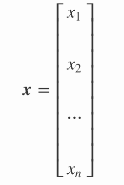
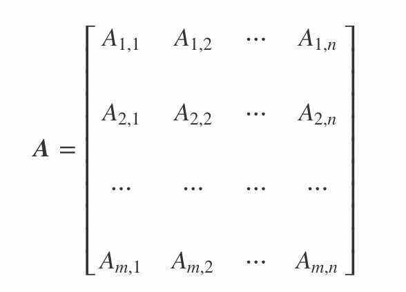

# Scalars, Vectors, Matrices and Tensors - Code Along


## Introduction 
In this lesson, we shall see a quick introduction to the basic mathematical entities used in linear algebra and how these get defined. We shall also look at how these entities are created ( and later manipulated) in Python using NumPy library. 

## Objectives
You will be able to:
* Understand and describe scalars, vectors, matrices and Tensor objects
* Understand how vectors and matrices are created in Python with Numpy 
* Perform basic vector operations tests like `.shape()` and `.transpose()`


## Background

Let's start with defining some mathematical entities that data scientists routinely come across while dealing with machine learning and deep learning algorithms. These entities are used to store, process and represent our data and analytical activities are mainly focused at manipulating these algebraic entities to provide solutions to unknown data entities. 


## Scalars

> A scalar is a single number. 

A sclar is the simplest entity in linear algebra compared to other objects, which are usually arrays of multiple numbers. In literature, you'll find scalars represented as lower case italics characters. Scalars need to be defined in terms of type of number these carry. For example: 

* **Real Valued scalars**: Let s ∈ **R** be the salary of an individual
* **Natural number scalars**: Let n ∈ **N** be the number of floors in a building

Processing single number values as we have been looking at so far all belong to scalar and scalar operations i.e. processing one number at a time, even when you are dealing with larger datasets. 

## Vectors 

> A vector is an **array** of numbers arranged in some order, as opposed to the single numbered scalar. 

A numbers contained within a vector are known as scalar components of the vector. Vectors are built from individual components, which are numerical in nature. We can think of a vector as a list of numbers, and vector algebra as operations performed on the numbers in the list. 




where **x** is the name of the vector and *x1,x2,x3,x4, --, xn* are the scalar components of the vector.

In machine learning systems like regression we saw earlier, the output variable is known as a **target vector** with the lowercase **y** when describing the training of a machine learning algorithm.

We can set index values to elements of a vector by defining a set containing the indices and write the set as a subscript. For example, to access x1, x3 and x6, we define the set S={1,3,6}, and call it **x<sub>S</sub>**. 


### A geometric intuition

A vector can be thought as an entity that represents spatial coordinates in an n-dimensional space, where n is the number of dimensions. A vector can also represent a line from the origin of the vector space with a direction and a magnitude, based on scalar components.  below is an example of a vector in 3d vector space. 


Let’s look at how to define a vector in Python.


### Defining a Vector in Python

In Python, one of the easiest ways to represent a vector is using Numpy arrays. The list scalar values can be used to create a vector in python as shown below:

```python 
# create a vector from list [2,4,6]
import numpy as np
v = np.array([2, 4, 6])
print(v)
```


```python
# Code here 
```

### Indexing a Vector

There are times when we have a lot of data in a vector (or array as we now know it) and we want to extract a portion of the data for some analysis. For example, maybe you want to know the first few values of a long array, or you want the integral of data between x = 4 and x = 6, but your vector covers 0 < x < 10. Indexing is the way to do these things. Let's generate a long vector to see this action using 10 values between -pi and pi (i.e. -3.14 to 3.14):

```python
x = np.linspace(-np.pi, np.pi, 10)
print(x)
```


```python
# Code here
```

We can use the index values to address individual scalar values within this vector , similar to python list indexing as shown below:
```python
print (x[0])  # first element
print (x[2])  # third element
print (x[-1]) # last element
print (x[-2]) # second to last element
```


```python
# Code here 
```

We can select a range of elements too. The syntax a:b extracts the ath to b-1th elements. The syntax a:b:n starts at a, skips n elements up to the index b.
```python 
print (x[1:4])     # second to fourth element. Element 5 is not included
print (x[0:-1:2])  # every other element
print (x[:])       # print the whole vector
print (x[-1:0:-1]) # reverse the vector!
```


```python
# Code here 
```

## Matrices
> A matrix is a 2 dimensional array of numbers written between square brackets. 

As compared to vectors, a matrix is a multi-dimensional array of scalars that can possibly have multiple rows as well as columns. It usually denoted by an m x n notation where m is the number of rows and n is number of columns as shown below Every scalar component of a matrix can be addressed by specifying row,col values as tuples (m,n). A matrix is usually written down as:




We usually give matrices uppercase variable names with bold typeface, such as **A**. If a real-valued matrix **A** has a height of **m** and a width of **n** as above, we state this as **A ∈ R<sup>*m×n*</sup>**.

>*In machine learning, a vector is known to be a special case of a matrix. A vector is a matrix that has only 1 column so you have an M x 1 matrix. M is the number of rows, and 1 here is the number of columns, so **matrix with just one column is what we call a vector.** *

### Defining a Matrix in Python

As opposed to one-dimensional arrays used by vectors, We can represent a matrix in Python using a multi-dimensional NumPy array. A NumPy array can be constructed given a list of lists. For example, below is a 3 row, 3 column matrix being created from a list of three lists.
```python
X = np.array([[1, 2, 3], [4, 5, 6], [7, 8, 9]])
print(X)
```


```python
# Code here 
```

* Note: Take special care with brackets during definition as opening and closing of the square brackets signifies a new row.


We can also define matlab styles matrices (for those used to matlab definitions) in the following way:
```python
Y = np.mat([[1, 2, 3], [4, 5, 6], [7, 8, 9]])
print (Y)
```


```python
# Code here 
```

Numpy **matrices** are strictly 2-dimensional, while numpy **arrays** (ndarrays) are N-dimensional. Matrix objects are a subclass of ndarray, so they inherit all the attributes and methods of ndarrays. For multidimensional arrays/matrices having more than 2 dimensions, it is always best to use arrays. Arrays are the standard vector/matrix/tensor type of NumPy and most NumPy function return arrays, not matrices. Arrays also offer a clear distinction between element-wise operations and linear algebra operations as we shall see later.

### Matrix Indexing

In 2d arrays like the one we created above, we use a row, column notation. We use a : to indicate all rows or all columns. 
* Keep in mind that the indexing in both vectors and matrices start at 0 and finishes at m-1 and n-1.

```python
print (X[0, 0]) # element at first row and first column
print (X[-1, -1]) # elemenet last row and last column 
print (X[0, :]) # first row and all columns
print (X[:, 0]) # all rows and first column 
print (X[:]) # all rows and all columns
```


```python
# Code here 
```

We can also use indexing to address and assign new values to elements of a matrix as shown below:
```python
X[:, 0] = [[11], [12], [13]] # set column 0
X[2, 2] = 15           # set a single element in third row and third column
print (X)

X[2] = 16  # sets everything in row 3 to 16!
print (X)

X[:,2] = 17  # sets everything in column 3 to 17!
print (X)
```


```python
# Code here 
```

## Shape of a Array

The shape (or DIMENSIONS) of a vector/matrix array tells us the number of values for each dimension. For a 2-dimensional array it will give you the number of rows and the number of columns. Let’s find the shape of our preceding 2-dimensional and 3-D arrays we created above. For a NumPy object, you can access its shape as shown below:
```python
print(x.shape) # the vector with 10 scalars
print (X.shape) # the 2-D Matrix with 3X3 scalar components
```


```python
# Code here 
```

The vector has only one dimension as shown by the shape parameter whereas the 2D matrix has 3 rows and 3 columns

## Transposition 

With transposition you can convert a row vector to a column vector and vice versa. Let's see how its done in vectors and matrices.


Neural networks frequently process weights and inputs of different sizes where the dimensions do not meet the requirements of matrix multiplication. Matrix transpose provides a way to “rotate” one of the matrices so that the operation complies with multiplication requirements and can continue. There are two steps to transpose a matrix:

* Rotate the matrix right 90° clockwise.
* Reverse the order of elements in each row (e.g. [a b c] becomes [c b a]).
This can be better understood looking at this image :


Numpy provides the transpose operation by simply using `.T` or `np.transpose()` with the array that needs to be transposed as shown below:

```python
# create a transpose of a matrix

A = np.array([
   [1, 2, 3], 
   [4, 5, 6],
   [7, 8, 9]])

A_transposed = A.T
A_transposed_2 = np.transpose(A)

print(A,'\n\n', A_transposed, '\n\n', A_transposed_2)
```


```python
# Code here 
```

#### and finally ..
## Tensors
In some cases we will need an array with more than two axes. In the general case:
>An array of numbers arranged on a regular grid with a variable number of axes is known as a tensor. 

A vector is a one-dimensional or first order tensor and a matrix is a two-dimensional or second order tensor.

Tensor notation is much like matrix notation with a capital letter representing a tensor and lowercase letters with subscript integers representing scalar values within the tensor. Many of the operations that can be performed with scalars, vectors, and matrices can be reformulated to be performed with tensors. Following image shows some ideas around slicing and indexing to access different sets of data stored in 3-D tensor. 


As a tool, tensors and tensor algebra is widely used in the fields of physics and engineering. It is a term and set of techniques known in machine learning in the training and operation of deep learning models can be described in terms of tensors. We shal revsisit tensors and relevant operations in the deep learning sections and explain how tensors are created, manipulated and saved using more advanced analytical tools like tensorflow. 


## Summary 

In this lesson we looked at the basic mathematical entities including scalars, vectors, matrices and tensors that are used to solve linear algebraic problems. We focused on creating vectors and matrices in python and Numpy. We also saw how to index and slice these entities and check for the shape of underlying data elements. Next, we shall look at some of the key operations which are performed with matrices and vectors. 
